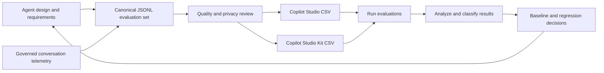

# Copilot Studio Evaluation Framework

A customizable baseline for designing, preparing, running, and analyzing
evaluations for Microsoft Copilot Studio agents.

## What this toolkit is

This project is a **starting point for building agent-specific evaluations and
evaluation pipelines**. It documents the overall evaluation lifecycle and provides
processing scripts, data contracts, synthetic examples, report templates, and
automation patterns that can be adapted to an agent's requirements.

It is **not a drop-in package that can be cloned and run unchanged against any
agent**. Copilot Studio agents differ in their UX flows, topics, tools, knowledge,
authentication, telemetry schemas, safety requirements, test data, and release
criteria. Before using the toolkit, teams must:

1. Define the behavior and risks of the agent under test.
2. Design agent-specific scenarios and expected outcomes.
3. Reconcile expected tool names and parameters with the deployed agent.
4. Adapt telemetry queries and mappings to the environment.
5. Configure evaluation targets, users, permissions, judges, and thresholds.
6. Review all datasets for privacy, security, and representative coverage.

The included synthetic banking agent demonstrates the workflow; it is an example,
not a default evaluation suite for other agents.

The framework supports two complementary sources:

- **Designed evaluations** derived from UX flows, journey maps, requirements, tool
  contracts, risks, and expected failure modes.
- **Observed evaluations** derived from consented, governed Application Insights
  conversation telemetry.

Both sources are normalized to a shared JSONL format and can be converted for the
Copilot Studio built-in Evaluation tool or the Power CAT Copilot Studio Kit.

## Lifecycle



See [process.md](process.md) for the complete step-by-step workflow and
[architecture.md](architecture.md) for the design, components, data contracts, and
extension points. See
[docs/publication-readiness.md](docs/publication-readiness.md) for the review
checklist to apply before publishing a customized implementation.

Contributions are governed by [CONTRIBUTING.md](CONTRIBUTING.md) and the
[Microsoft Open Source Code of Conduct](CODE_OF_CONDUCT.md). Report security
vulnerabilities according to [SECURITY.md](SECURITY.md). See
[SUPPORT.md](SUPPORT.md) for the best-effort community support policy.

## Repository layout

| Path | Purpose |
| --- | --- |
| `scripts/` | Conversion, preparation, execution, and reporting utilities |
| `config/` | Example tool mappings and automated test-set selection |
| `schemas/` | Canonical evaluation JSON Schema |
| `docs/` | Detailed usage and automation guidance |
| `telemetry/` | Application Insights queries, workbook generators, and observability guidance |
| `data/` | Committed synthetic banking examples: source flows, acceptance criteria, evaluation sets, generated imports, baseline template, and latency fixtures |
| `reports/` | Committed generic PowerPoint templates for baseline findings and observability walkthroughs |

## Example workflow

Python 3.9 or later is required. Core converters use only the standard library.
Image, report, and API helpers use the packages in `requirements-optional.txt`:

```powershell
python -m pip install -r requirements-optional.txt
```

The commands below illustrate the processing pipeline after agent-specific inputs
and configuration have been prepared.

```powershell
# Telemetry CSV exports -> canonical JSONL
python scripts\convert_appinsights_to_eval_general.py `
  --messages data\local\messages.csv `
  --tools data\local\toolcalls.csv `
  --tool-map config\tool-map.example.json `
  --output data\eval-sets\eval.jsonl

# Validate canonical JSONL before export
python scripts\validate_eval_jsonl.py data\eval-sets\eval.jsonl

# Canonical JSONL -> Copilot Studio import files
python scripts\convert_jsonl_to_copilot_csv.py `
  data\eval-sets\eval.jsonl data\generated\eval_copilot.csv

python scripts\convert_jsonl_to_kit_csv.py `
  data\eval-sets\eval.jsonl data\generated\eval_kit.csv `
  --test-set "Agent regression"

# Create and summarize a durable results record
python scripts\generate_baseline_template.py `
  data\eval-sets\eval.jsonl data\baseline\results.csv

python scripts\summarize_baseline_results.py data\baseline\results.csv
```

Omit `--tools` and `--tool-map` when tool-call telemetry is unavailable.

## Evaluation principles

1. Derive expected behavior from the deployed agent version, not from another
   agent's test set.
2. Combine designed coverage with representative real-world behavior.
3. Keep requirement, capability, risk, and tool traceability.
4. Review telemetry-derived cases for privacy, consent, retention, and data
   minimization before they enter version control.
5. Separate immutable source evidence, curated evaluation cases, generated import
   files, and run results.
6. Record the agent version, environment, evaluator configuration, and run date
   with every baseline.
7. Diagnose failures before changing thresholds or expected outputs.

## Included samples

The `data/` directory contains an end-to-end fictional banking-agent example,
including UX flows, acceptance criteria, designed evaluations, synthetic
observed-style conversations, Copilot Studio import files, a baseline recording
template, and latency evaluations.

The `reports/` directory contains editable, agent-neutral PowerPoint templates.
These samples are intended to demonstrate the workflow and should be copied and
adapted rather than treated as evaluation criteria for another agent.

## License

Copyright (c) Microsoft Corporation. All rights reserved.

Licensed under the [MIT License](LICENSE).

## Trademarks

This project may contain trademarks or logos for projects, products, or services.
Authorized use of Microsoft trademarks or logos is subject to and must follow
[Microsoft's Trademark & Brand Guidelines](https://www.microsoft.com/legal/intellectualproperty/trademarks/usage/general).
Use of Microsoft trademarks or logos in modified versions of this project must not
cause confusion or imply Microsoft sponsorship. Any use of third-party trademarks
or logos is subject to those third parties' policies.
