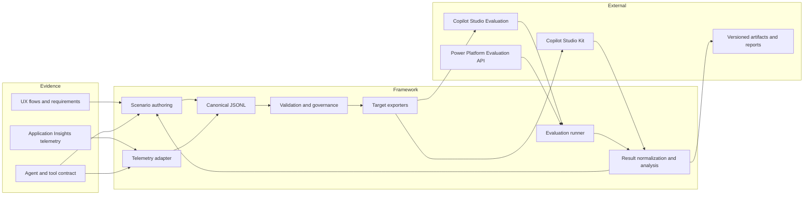

# Copilot Studio Evaluation Framework Architecture

## 1. Goals

The framework provides a repeatable, agent-agnostic path from design evidence and
conversation telemetry to executable Copilot Studio evaluations and durable
regression results.

The design prioritizes:

- a runner-neutral canonical evaluation format;
- clear separation of generic logic and agent-specific configuration;
- traceability from requirements and risks to results;
- privacy-safe handling of conversation data;
- reproducible generation and execution;
- extensibility for telemetry schemas, evaluation targets, and reporting.

## 2. Non-goals

The framework does not:

- define the business behavior of an agent;
- treat historical responses as ground truth without review;
- guarantee exact tool correlation when telemetry lacks shared identifiers;
- provision Copilot Studio agents or test sets;
- replace security, privacy, accessibility, or human acceptance reviews;
- publish raw production conversations or environment credentials.

## 3. System context



## 4. Logical components

### 4.1 Evidence and authoring

Designed scenarios are authored from UX artifacts, requirements, process flows,
tool contracts, risks, and known limitations. This component is agent-specific by
definition, but its output follows the shared schema.

### 4.2 Telemetry adapters

Telemetry adapters translate platform-specific exports into normalized turns.
`scripts\convert_appinsights_to_eval_general.py` is the current generic Copilot
Studio adapter. Agent-specific behavior belongs in external configuration such as a
tool-name map, not in the core converter.

An adapter is responsible for:

- recognizing message and action events;
- extracting conversation identifiers and timestamps;
- grouping events into turns;
- mapping raw tools to canonical tool names;
- recording correlation confidence;
- avoiding invention of missing evidence.

### 4.3 Canonical evaluation model

JSONL is the system-of-record format because it is diffable, streamable, easy to
generate, and independent of any one evaluation runner.

Core fields:

| Field | Purpose |
| --- | --- |
| `conversation_id` | Stable logical conversation identifier |
| `turn_number` | One-based order within the conversation |
| `user_message` | Input for the turn; null only for intentional agent-only turns |
| `expected_tool_calls` | Expected canonical tools and parameter constraints |
| `expected_response_pattern` | Behavioral response assertion |
| `pass_criteria` | Which observable dimensions determine success |
| `category` | Primary analysis grouping |

Optional extension fields include `must_not_call`, `response_must_not_match`,
`evaluation_context`, requirement IDs, risks, capability IDs, priority, locale,
persona, source, tags, and correlation confidence.

`schemas/evaluation.schema.json` defines the machine-readable contract. Schema
evolution should be additive where possible; incompatible versions should receive a
new schema identifier.

### 4.4 Validation and governance

Validation is a mandatory boundary between raw/curated inputs and generated runner
files. It should check:

- schema and type correctness;
- conversation and turn ordering;
- supported pass criteria;
- tool-name reconciliation;
- regex validity;
- requirement and risk coverage;
- duplicate or conflicting cases;
- privacy, secret, and identifier patterns;
- source and dataset metadata.

Run the standard-library validator before export:

```powershell
python scripts\validate_eval_jsonl.py <evaluation.jsonl>
```

### 4.5 Target exporters

Exporters are pure transformations from canonical JSONL to runner-specific formats:

- `convert_jsonl_to_copilot_csv.py` creates conversational evaluation CSV chunks.
- `convert_jsonl_to_kit_csv.py` creates Copilot Studio Kit Agent Test rows.
- `generate_baseline_template.py` creates a durable manual result-recording sheet.

Runner limits belong in exporter options and constants, not in authored evaluation
content.

### 4.6 Execution

Evaluations can run through:

- the Copilot Studio portal;
- the Copilot Studio Kit;
- `run_copilot_eval.py`, which invokes existing test sets through the Power Platform
  Evaluation API.

Execution configuration includes environment ID, agent ID, draft/published state,
test-set identity, evaluation profile, methods, thresholds, and authentication.
Secrets are supplied at runtime and must never be stored in evaluation data.

### 4.7 Results and analysis

Result processing records raw runner output and derives normalized outcomes,
grouped metrics, regressions, and failure classifications.
`summarize_baseline_results.py` currently provides baseline aggregation. Rich report
generation should consume normalized results and configurable labels rather than
embed agent-specific taxonomies or branding.

### 4.8 Observability

The `telemetry\` subsystem contains KQL and Azure Monitor Workbook generators for
tool performance, latency, errors, and conversation troubleshooting. Source KQL and
Python builders are authoritative; generated workbook JSON is derived output.

Telemetry event names and custom dimensions vary by environment and integration.
They should be implemented as documented adapters or configuration, not assumed to
be universal.

## 5. Data flow and artifact states

```mermaid
flowchart LR
    A[Private raw evidence] -->|adapter or authoring| B[Curated JSONL]
    B -->|validate| C[Approved evaluation set]
    C -->|export| D[Generated runner files]
    D -->|execute| E[Raw run results]
    E -->|normalize| F[Analysis and baseline]

    classDef private fill:#F8D7DA,stroke:#842029,color:#212529,stroke-width:2px;
    classDef review fill:#FFF3CD,stroke:#664D03,color:#212529,stroke-width:2px;
    classDef generated fill:#D1E7DD,stroke:#0F5132,color:#212529,stroke-width:2px;
    class A private;
    class B,C review;
    class D,E,F generated;
```



| State | Version-control policy |
| --- | --- |
| Raw telemetry and source Office artifacts | Private and ignored |
| Curated telemetry-derived cases | Private unless independently synthesized and approved |
| Synthetic designed JSONL | Commit after review |
| Generated import CSV | Regenerable; commit only when useful for release traceability |
| Raw run exports | Store according to data classification and retention rules |
| Aggregate reports | Commit only when free of sensitive content and internal identifiers |

## 6. Current repository structure

```text
.
|-- README.md
|-- process.md
|-- architecture.md
|-- AGENTS.md
|-- requirements-optional.txt
|-- config/
|   |-- tool-map.example.json
|   `-- eval-testsets.example.json
|-- schemas/
|   `-- evaluation.schema.json
|-- scripts/
|   |-- validate_eval_jsonl.py
|   |-- convert_appinsights_to_eval_general.py
|   |-- convert_jsonl_to_copilot_csv.py
|   |-- convert_jsonl_to_kit_csv.py
|   |-- generate_baseline_template.py
|   |-- summarize_baseline_results.py
|   `-- run_copilot_eval.py
|-- telemetry/
|   |-- queries/
|   |-- dashboards/
|   `-- docs/
|-- reports/
|   |-- baseline-evaluation-report-template.pptx
|   `-- observability-walkthrough-template.pptx
|-- data/
|   |-- source/      # synthetic banking design artifacts
|   |-- eval-sets/   # synthetic canonical JSONL
|   |-- generated/   # derived runner files
|   |-- baseline/    # sample run-recording template
|   `-- latency/     # synthetic latency fixtures
`-- docs/
```

## 7. Configuration and extension points

Agent-specific configuration should cover:

- message and action event names;
- custom-dimension field mappings;
- canonical tool-name mappings;
- expected table/entity constraints;
- categories and traceability vocabulary;
- runner import limits;
- test-set names and thresholds;
- environment-specific IDs supplied outside committed files;
- report title, labels, branding, and failure taxonomy.

New telemetry sources implement the adapter contract and emit canonical JSONL. New
evaluation targets consume canonical JSONL. New analyzers consume normalized result
records. This keeps integrations independent.

## 8. Security and privacy architecture

1. Raw telemetry is a restricted input, never a public fixture.
2. Authentication tokens, application IDs, tenant IDs, environment IDs, connection
   strings, and API keys are runtime configuration.
3. Public examples are generated independently with fictional entities and reserved
   domains such as `example.test`.
4. Reports use aggregates and synthetic excerpts unless explicit approval permits
   otherwise.
5. Timestamp correlation is labeled approximate when no shared conversation ID is
   available.
6. Ignore rules are defense in depth, not approval to retain sensitive material in a
   repository history.
7. The first public repository should begin with clean history after legacy artifacts
   have been removed or rebuilt.

## 9. Quality attributes

| Attribute | Design response |
| --- | --- |
| Reproducibility | Canonical inputs, deterministic exporters, recorded run metadata |
| Portability | Python 3.9+, standard-library core, runner-neutral JSONL |
| Extensibility | Adapter/exporter/analyzer boundaries and external mappings |
| Auditability | Traceability tags, immutable run evidence, explicit classifications |
| Privacy | Private raw-data boundary, minimization, synthetic public fixtures |
| Reliability | Validation before execution and blocked/error outcome separation |
| Maintainability | Source queries/builders authoritative over generated artifacts |

## 10. Known gaps and roadmap

Remaining framework enhancements:

1. Add automated tests for converters, chunking, grouping, correlation, invalid
   input, and privacy checks.
2. Add generated-workbook consistency checks and deterministic workbook IDs.
3. Make telemetry dimensions, query exports, and pricing data configurable.
4. Add normalized result ingestion and versioned run manifests.
5. Add community templates and repository automation before creating the public
   GitHub repository.
