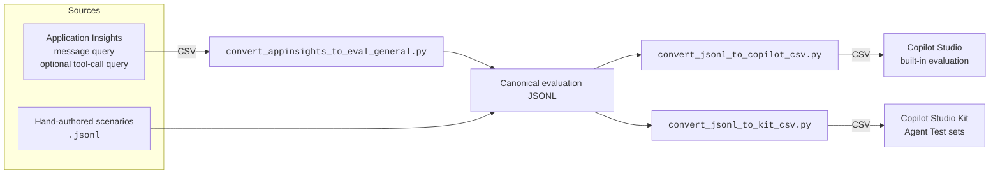

# Creating and Running Agent Evaluations (General Guide)

This page is a **reusable guide** for building evaluation test sets for **any Microsoft
Copilot Studio agent** and running them in **Copilot Studio (built-in evaluation)** and the
**Copilot Studio Kit**.

[[_TOC_]]

---

## Conventions used on this page

Replace these placeholders with your agent's values throughout:

| Placeholder | Meaning | Example |
| --- | --- | --- |
| `<AGENT_NAME>` | Display name of your agent | Customer Support Agent |
| `<WORKING_FOLDER>` | Local folder where you run the scripts | `C:\projects\copilot-studio-evals` |
| `<TEST_SET_NAME>` | Name you give a test set | `Customer Support - Regression` |
| `<TIME_WINDOW>` | KQL lookback window | `14d` |

Wherever you see a placeholder block like this, a script file is attached at that location
(in the Azure DevOps wiki editor, use **Insert → Attachment** or drag the file in):

> 📎 **ATTACHMENT:** `example_script.py` — _(attach the script here)_

---

## Overview

The pipeline turns agent telemetry (and optional hand-authored scenarios) into import-ready
test sets for two evaluation tools.



**Two possible data sources** feed the same JSONL intermediate format:

| Source | What it is | Required? |
| --- | --- | --- |
| **Real conversations** | Extracted from your agent's Application Insights telemetry | Recommended |
| **Designed scenarios** | Hand-authored conversations covering flows you care about | Optional |

**Two run targets:**

| Target | Strengths | Import format |
| --- | --- | --- |
| **Copilot Studio built-in evaluation** | Native, quick, no extra setup; conversation (multi-turn) test sets | `conversationNumber, question, response` CSV |
| **Copilot Studio Kit** | Richer test types (Plan Validation, Topic Match, Generative Answers), enrichment from App Insights/Dataverse, bulk Excel | Agent Test rows pasted into Excel Online |

---

## Prerequisites

- **CPython 3.11-3.14** on PATH (`python --version`). The core conversion scripts
  use the standard library only.
- **Application Insights telemetry enabled on the agent.** In Copilot Studio, open the agent
  → **Settings → Advanced** (Metadata) and connect an Application Insights resource. Without
  telemetry there are no conversations to extract. See
  [Analyze agent usage with Application Insights](https://learn.microsoft.com/en-us/microsoft-copilot-studio/advanced-bot-framework-composer-capabilities).
- **Read access** to that Application Insights resource (Azure portal → Logs).
- **Maker access** to the agent in [Copilot Studio](https://copilotstudio.microsoft.com/).
- For the Kit path: the **Power CAT Copilot Studio Kit** installed in your environment.
  See [Installation instructions](https://github.com/microsoft/Power-CAT-Copilot-Studio-Kit/blob/main/INSTALLATION_INSTRUCTIONS.md).
- The conversion scripts (attached in [Script attachments](#script-attachments)).

---

## Script attachments

> 📎 **ATTACHMENT:** `convert_appinsights_to_eval_general.py` — App Insights CSVs → eval JSONL (agent-agnostic)
> _(attach file here)_

> 📎 **ATTACHMENT:** `convert_jsonl_to_copilot_csv.py` — JSONL → Copilot Studio built-in CSV
> _(attach file here)_

> 📎 **ATTACHMENT:** `convert_jsonl_to_kit_csv.py` — JSONL → Copilot Studio Kit CSV
> _(attach file here)_

> 📎 **ATTACHMENT:** `generate_baseline_template.py` — JSONL → baseline results-recording CSV
> _(attach file here)_

> 📎 **ATTACHMENT:** `summarize_baseline_results.py` — filled results CSV → benchmark numbers
> _(attach file here)_

---

## Step 1 — Extract conversations from Application Insights

### 1.1 Open Logs

In the Azure portal, open the agent's **Application Insights** resource and select **Logs**.

### 1.2 Export messages → `messages.csv`

This query is **standard across Copilot Studio agents** — it reads the built-in
`BotMessageReceived` / `BotMessageSend` events. Adjust `<TIME_WINDOW>`. Run it, then
**Export → Export to CSV (all columns)** and save as **`messages.csv`**.

```kusto
customEvents
| where timestamp > ago(14d)
| where name in ("BotMessageReceived", "BotMessageSend")
| extend
    conversationId = tostring(customDimensions["conversationId"]),
    messageText = coalesce(
        tostring(customDimensions["text"]),
        tostring(customDimensions["Text"])
    )
| where isnotempty(conversationId)
| project conversationId, timestamp, type = name, message = messageText
| order by conversationId asc, timestamp asc
| extend ev = pack(
        "timestamp", timestamp,
        "type", type,
        "message", message,
        "toolName", "",
        "outcome", "",
        "success", "true",
        "duration", 0
    )
| summarize events = make_list(ev), eventCount = count() by conversationId
| order by conversationId asc
```

### 1.3 (Optional) Export tool/action calls → `toolcalls.csv`

This step is **agent-specific** and **optional**. How your agent's tool, plugin, action, or
connector calls are logged depends on how it's built:

- **MCP-based tools** are typically logged in the `dependencies` table.
- **Connector / Power Platform actions** may appear as other `dependencies` rows.
- **Topic actions** appear as `TopicAction` rows in `customEvents`.
- Some agents have **no separable tool log** — in that case, skip this step and run the
  converter in messages-only mode.

First, **discover** what your agent emits. Run this to list dependency names:

```kusto
dependencies
| where timestamp > ago(14d)
| summarize calls = count() by name
| order by calls desc
```

Then write an export query that projects your tool calls into these columns —
`timestamp, toolName, outcome, success, duration` — and save the result as **`toolcalls.csv`**.
For example, an MCP agent that logs a `mcp.tool` dependency with the tool name in a custom
dimension would use:

```kusto
dependencies
| where timestamp > ago(14d)
| where name == "mcp.tool"                          // <-- change to YOUR tool dependency name
| extend
    toolName = tostring(customDimensions["mcp.tool.name"]),   // <-- change to YOUR field
    outcome  = tostring(customDimensions["outcome"])          // <-- change/remove as needed
| project timestamp, toolName, outcome, success, duration
| order by timestamp asc
```

> 📝 **Note:**
> The converter correlates tool calls to conversations by **timestamp** (there is usually no
> shared ID between the tool-call dependency rows and the conversation events). Use the
> **same `<TIME_WINDOW>`** for both queries.

You should now have **`messages.csv`** and, optionally, **`toolcalls.csv`**.

---

## Step 2 — Generate the JSONL eval file

Run the agent-agnostic converter.

**With tool calls:**

```powershell
cd <WORKING_FOLDER>
python convert_appinsights_to_eval_general.py --messages messages.csv --tools toolcalls.csv --output eval.jsonl
```

**Messages only (no separable tool log):**

```powershell
python convert_appinsights_to_eval_general.py --messages messages.csv --output eval.jsonl
```

Useful options:

| Option | Purpose |
| --- | --- |
| `--tool-map toolmap.json` | Normalize raw tool names to canonical names. JSON of `{ "raw name": "Canonical.Name" }` (keys are matched case-insensitively). Unmapped names pass through unchanged. |
| `--category <value>` | Stamp a fixed `category` on every turn (e.g. `regression`). When omitted, a generic **structural** category is inferred: `single-turn`, `multi-turn`, `tool-use`, `multi-turn-tool-use`, or `error`. |
| `--min-turns N` | Drop conversations with fewer than N turns. |
| `--prefix <p>` | Prefix for generated conversation IDs (default `conv`). |

> 💡 **Tip:**
> Use `--tool-map` when the names in telemetry differ from the tool/plugin names shown in
> your agent's orchestration plan — this matters for **Plan Validation** tests in the Kit
> (Step 3B / 4B).

**JSONL schema** (one logical turn per line):

```json
{
  "conversation_id": "conv-021-9e625192",
  "turn_number": 2,
  "user_message": "…the user's message…",
  "expected_tool_calls": [{ "tool": "Search Contacts", "params": {} }],
  "expected_response_pattern": "(?i)(found|here)",
  "pass_criteria": "both",
  "category": "multi-turn-tool-use"
}
```

> 📝 **Note:**
> **Hand-authored scenarios (optional).** To cover flows that don't appear in telemetry
> (edge cases, security/negative tests), author conversations directly as JSONL using the
> same schema, then feed that file through Step 3 just like the extracted one. See
> [`process.md`](../process.md) for the scenario-design workflow.

Validate telemetry-derived and hand-authored JSONL before conversion:

```powershell
python validate_eval_jsonl.py eval.jsonl
```

---

## Step 3 — Generate the import files

These two converters are **agent-agnostic** — they consume the JSONL from Step 2.

### Step 3A — Files for direct Copilot Studio import

```powershell
python convert_jsonl_to_copilot_csv.py eval.jsonl eval_copilot.csv
```

Produces a `conversationNumber, question, response` CSV. The script keeps the most valuable
cases first (turns with tool calls, then most turns) and enforces the import limits:

- **20 conversations** max per file · **6 Q&A pairs** max per conversation · **500 characters** max per question.
- The optional `response` column is left blank (the eval tool scores the live reply itself).

> ⚠️ **Warning:**
> Limits can vary by tenant or release. If an import is rejected for size, re-run with
> tighter caps:
> ```powershell
> python convert_jsonl_to_copilot_csv.py eval.jsonl eval_copilot.csv --chunk-size 10 --max-turns 4
> ```

### Step 3B — Files for Copilot Studio Kit import

```powershell
python convert_jsonl_to_kit_csv.py eval.jsonl eval_kit.csv --test-set "<TEST_SET_NAME>"
```

Emits one row per user turn and auto-selects a Kit **Test Type**:

- Turn invokes tools → **Plan Validation** (`Expected Tools` set; `Pass Threshold (%)` = 100).
- Turn has a response only → **Generative Answers** (`Expected Response` as the validation hint).
- Otherwise → **Response Match** (fill in the expected response yourself).

Columns map to the Kit Agent Test fields plus helper columns (`Multiturn Conversation`,
`Order`) for assembling multi-turn tests.

> 📝 **Note:**
> **Plan Validation** requires the agent to use **generative orchestration**, and the
> `Expected Tools` values must match the tool/plugin names in the agent's plan. Use
> `--tool-map` in Step 2 to align names if telemetry uses different ones.

---

## Step 4 — Run the evaluations

### Step 4A — Run in Copilot Studio (built-in evaluation)

1. Open [copilotstudio.microsoft.com](https://copilotstudio.microsoft.com/) and select **<AGENT_NAME>**.
2. Open the agent's **Evaluation** page (under **Analytics**).
3. Select **New evaluation → Conversation**.
4. Choose **import from spreadsheet / file** and upload your CSV (`eval_copilot.csv`).
5. Give the test set a **Name**.
6. Add the **test methods** you want (combinable):
   - **General quality** (default; rates response quality, no config).
   - **Keyword match** (pass/fail on expected keywords/phrases).
   - **Capabilities match** (checks expected tools/capabilities were used).
   - **Custom / Classification** (pass/fail against criteria you define).
7. Select a **User profile** — the account the evaluation uses to reach the agent's knowledge
   and tools. Choose one with the access your agent needs.
8. Select **Evaluate** to run now, or **Save** to run later.
9. Review per-test-case and aggregate **pass/fail** and scores. This is your baseline benchmark.

> 💡 **Tip:**
> Results are retained in Copilot Studio for **89 days**. Export results to CSV to keep them longer.

### Step 4B — Run in Copilot Studio Kit

**One-time setup (per agent):**

1. Open the **Power CAT Copilot Studio Kit** app.
2. Create an **Agent Configuration** record for **<AGENT_NAME>** (Direct Line / token endpoint).
   Enable the enrichments you need:
   - **Dataverse** → **Topic Match** tests and triggered-topic details.
   - **Application Insights** → negative checks and plan details.
   - **AI Builder** → **Generative Answers** scoring.

**Create the test set and import tests:**

1. Go to **Test Sets** → **New Agent Test Set**. Name it to match your `--test-set` value. **Save**.
2. In the subgrid, switch the view from **Tests** to **Export/Import View**.
3. Select **Export Agent Tests in Excel Online**.
4. Open your generated `eval_kit.csv` and **copy the rows** into the matching columns of the
   Excel Online sheet (`Test Utterance`, `Test Type`, `Expected Tools`, `Pass Threshold (%)`,
   `Expected Response`, etc.).
5. Select **Save** and wait for the import to complete.

> ⚠️ **Warning:**
> For **multi-turn** Kit tests, import the **parent** multi-turn test first, then the **child**
> tests (using the `Multiturn Conversation` / `Order` helper columns to group and order them).

**Run and analyze:**

1. From the test set, select **Run**. The Kit sends each utterance via Direct Line and records
   latency, triggered topic, response, and pass/fail.
2. Post-run enrichment evaluates Topic Match, Generative Answers, and Plan Validation.
3. Open the **Test Run** record to review the success rate and drill into failures. Export as needed.

References: [Enhance agent testing with Copilot Studio Kit](https://learn.microsoft.com/en-us/microsoft-copilot-studio/guidance/kit-test-capabilities)
· [Configure tests](https://github.com/microsoft/Power-CAT-Copilot-Studio-Kit/blob/main/CONFIGURE_TESTS.md)

---

## Step 5 — Record the baseline snapshot

The first run against the current agent is the **baseline benchmark**: the pass/fail numbers
every future change is measured against. Capture it in a durable file rather than leaving it
only in the portal (Copilot Studio retains results for ~89 days).

**1. Generate a results-recording template** from your eval JSONL:

```powershell
cd <WORKING_FOLDER>
python generate_baseline_template.py eval.jsonl baseline_results_template.csv --group-by category
```

This produces one row per evaluation turn, pre-filled with the expected behavior
(`user_message`, `expected_tool_calls`, `must_not_call`, `expected_response_pattern`,
`pass_criteria`, and your grouping column) plus blank columns to fill in during the run:
`Run Date, Run Target, Result, Actual Tools, Actual Response, Notes`.

> 📝 **Note:**
> `--group-by` selects the JSONL field the summary rolls up by. The general converter stamps
> a `category` field (structural categories like `tool-use`, `multi-turn`, `error`), so use
> `--group-by category`. If your hand-authored scenarios use a different traceability tag,
> pass that field instead.

**2. Run the evaluation** (Step 4A and/or 4B) and, for each turn, fill in:

- **Run Date** — date of the run.
- **Run Target** — `Copilot Studio` or `Kit`.
- **Result** — `PASS`, `FAIL`, or `BLOCKED` (BLOCKED = couldn't be evaluated, e.g. missing
  access or a dependent turn failed).
- **Actual Tools** / **Actual Response** — what the agent actually did (paste from the
  results view; enough to justify the PASS/FAIL).
- **Notes** — failure reason or anything noteworthy.

> 💡 **Tip:**
> Export the portal/Kit results to CSV and use them to fill the `Actual *` columns quickly,
> then set `Result` per turn. Keep the filled file in the wiki/repo as the signed-off baseline.

**3. Summarize the benchmark** — once `Result` is filled in, compute overall and per-group
pass rates and a failure list:

```powershell
python summarize_baseline_results.py baseline_results_template.csv
```

Use `--group-split "-"` when a custom grouping field uses hierarchical tags and you want to
roll up by the prefix. Example output:

```
Total turns:      120
  PASS:    104
  FAIL:    11
  BLOCKED: 5
Pass rate (of graded PASS+FAIL): 90%

By category:
  group                  PASS  FAIL  BLOCK    rate
  error                     8     2      1      80%
  multi-turn-tool-use      41     6      3      87%
  single-turn              55     3      1      95%
```

Attach both the filled `baseline_results_template.csv` and the summary output as the recorded
baseline. Re-run against a fresh copy after each agent change to track regressions against
this benchmark.

> 📎 **ATTACHMENT:** `baseline_results_template.csv` — the recorded baseline run
> _(attach the filled-in file here after the run)_

---

## Quick reference

```powershell
cd <WORKING_FOLDER>

# 1. (Azure portal) Run the messages query  -> save as messages.csv
#    (optional)      Run a tool-call query   -> save as toolcalls.csv

# 2. App Insights CSVs -> JSONL  (drop --tools if you have no tool log)
python convert_appinsights_to_eval_general.py --messages messages.csv --tools toolcalls.csv --output eval.jsonl

# 3A. JSONL -> Copilot Studio built-in CSV
python convert_jsonl_to_copilot_csv.py eval.jsonl eval_copilot.csv

# 3B. JSONL -> Copilot Studio Kit CSV
python convert_jsonl_to_kit_csv.py eval.jsonl eval_kit.csv --test-set "<TEST_SET_NAME>"

# 4A. Copilot Studio: Evaluation -> New evaluation -> Conversation -> import CSV -> Evaluate
# 4B. Copilot Studio Kit: Test Sets -> create set -> Export/Import View -> paste rows -> Run

# 5. Baseline snapshot: generate template, run, fill Result column, summarize
python generate_baseline_template.py eval.jsonl baseline_results_template.csv --group-by category
python summarize_baseline_results.py baseline_results_template.csv
```

---

## What you must customize per agent

| Area | Agent-specific? | Notes |
| --- | --- | --- |
| Messages query (1.2) | No | Standard Copilot Studio telemetry schema |
| Tool-call query (1.3) | **Yes** | Depends on how the agent logs tools/actions; optional |
| `--tool-map` | **Yes** | Map telemetry tool names to plan/plugin names |
| `--category` / inference | No | Generic structural categories by default |
| Built-in CSV converter (3A) | No | Agent-agnostic |
| Kit CSV converter (3B) | No | Agent-agnostic; tool names pass through |
| Run steps (4A / 4B) | No | Only names/test-set labels change |
| Baseline template/summary (5) | No | Agent-agnostic; pass `--group-by` to match your tag field |
| Hand-authored scenarios | **Yes** | Content is agent-specific; format is shared |

---

## Limits & troubleshooting

| Symptom | Cause / fix |
| --- | --- |
| No conversations extracted | Telemetry isn't enabled on the agent, or the time window is too narrow. |
| `PermissionError: Permission denied` writing a CSV | The target file is open in Excel. Close it and re-run. |
| Built-in import rejected for size | Re-run 3A with `--chunk-size 10 --max-turns 4`. |
| No/few tool calls captured | Tool-call query doesn't match how your agent logs tools (see 1.3 discovery query), or the time window differs from the messages query. |
| Kit **Topic Match** doesn't evaluate | Dataverse enrichment isn't configured. |
| Kit **Generative Answers** stuck pending | AI Builder enrichment isn't configured. |
| **Plan Validation** always fails | Agent isn't using generative orchestration, or `Expected Tools` names don't match the plan (use `--tool-map`). |
