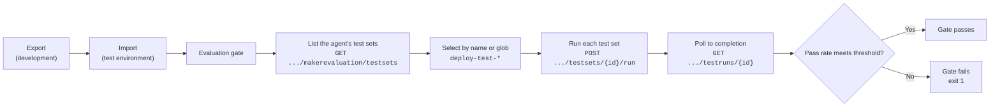

# Automated Agent Evaluation in CI/CD (Post-Deployment Gate)

This describes how the deployment pipeline runs the **built-in Copilot Studio
evaluations** against the agent right after it is imported into an environment,
and fails the pipeline if quality drops below a threshold.

- **Runner:** [`scripts/run_copilot_eval.py`](../scripts/run_copilot_eval.py) (`gate` command)
- **Workflow:** add an `eval` job to your deployment workflow after the agent import step.
- **Selection config:** create a repository-local configuration such as
  `config/eval-testsets.json`.

---

## How it works



The built-in evaluator's Power Platform REST API (`api.powerplatform.com`,
`api-version=2024-10-01`) is used directly — there is **no** `pac` verb or
`powerplatform-actions` step for evaluations, so the runner calls the API itself.

> 📝 **Note:** The API can *run* test sets but **cannot create** them. Create each
> test set once in the Copilot Studio portal (Evaluations → import a CSV produced
> by `convert_jsonl_to_copilot_csv.py`, or AI-generate cases), then this pipeline
> runs them on every deployment.

---

## Choosing which test sets run

Because test-set names may not be known ahead of time, selection supports **both**
explicit names and **glob patterns**, matched against the agent's live test sets
(case-insensitive). Sources are merged (CLI + config file):

| Source | Field / flag | Example |
| --- | --- | --- |
| Config file | `testSetNamePatterns` | `["deploy-test-*"]` |
| Config file | `testSetNames` | `["Regression - core flows"]` |
| Workflow input | `test_set_pattern` | `deploy-test-*` |
| CLI | `--pattern` / `--test-set` (repeatable) | `--pattern "deploy-test-*"` |

If nothing is specified, the default pattern is `deploy-test-*`. **Recommended
convention:** name any test set that should run on deploy `deploy-test-<name>`
(e.g. `deploy-test-happy-path`, `deploy-test-negative`). New matching test sets
are picked up automatically — no pipeline change needed.

Preview what would run without executing:

```bash
python scripts/run_copilot_eval.py gate \
  --env-id <ENV> --bot-id <BOT> --pattern "deploy-test-*" --dry-run
```

### `eval-testsets.json`

Copy `config/eval-testsets.example.json` to `config/eval-testsets.json`, then
customize the selection and threshold:

```json
{
  "testSetNamePatterns": ["deploy-test-*"],
  "testSetNames": [],
  "passThreshold": 1.0,
  "runOnPublishedBot": true
}
```

Point the runner at it with `--config config/eval-testsets.json`.

---

## Authentication

The eval job authenticates to the Power Platform API. Any Entra identity used
must be added as an **Application User** in the target environment and hold the
Copilot Studio maker-evaluation permission.

| Mode | When to use | How |
| --- | --- | --- |
| **OIDC federation** (recommended) | GitHub-hosted runners | `azure/login` with workload-identity federation, then `az account get-access-token --resource https://api.powerplatform.com`; the runner reads `POWERPLATFORM_TOKEN`. |
| **Managed identity** | Self-hosted **Azure** runners | `run_copilot_eval.py gate --managed-identity [--mi-client-id <ID>]` (token from IMDS; not reachable on GitHub-hosted runners). |
| **Client secret** | Simplest, stored secret | `--client-id <APP> --client-secret <SECRET>` (or env `PP_SP_CLIENT_SECRET`). |
| **Device code** | Local/interactive | `--client-id <APP>` (no secret). |

The example workflow design uses the **OIDC federation** path.

### Required GitHub config for the `eval` job

| Kind | Name | Purpose |
| --- | --- | --- |
| Secret | `AZURE_CLIENT_ID` / `AZURE_TENANT_ID` / `AZURE_SUBSCRIPTION_ID` | Federated `azure/login` (already used by other workflows). |
| Environment variable | `PP_ENVIRONMENT_ID` | Power Platform environment **GUID** (not the URL). |
| Environment variable | `PP_TEST_BOT_ID` | The agent/bot **GUID** (Copilot Studio → agent → Settings). |

---

## Results & the gate

- Per-test-case results are scored into a pass rate. A `TestCaseResult` has no
  Pass/Fail of its own (only `Completed`/`Error`/...); pass/fail lives on each
  metric at `metric.result.status`. A case passes if it has metrics and all of
  them are `Pass`.
- The overall pass rate across all selected sets is compared to `pass_threshold`
  (default `1.0`). Below it — or if any run reports `Failed` — the job exits `1`
  and the pipeline fails.
- A JSON summary is written (`eval-results.json`) and uploaded as the
  **`eval-results`** workflow artifact for review.

Tune the bar with the `pass_threshold` workflow input (e.g. `0.9`) or
`passThreshold` in the config file.

---

## Local run (smoke test)

```bash
export POWERPLATFORM_TOKEN="$(az account get-access-token \
  --resource https://api.powerplatform.com --query accessToken -o tsv)"

python scripts/run_copilot_eval.py gate \
  --env-id <ENV_GUID> --bot-id <BOT_GUID> \
  --config config/eval-testsets.json \
  --output eval-results.json
echo "exit: $?"   # 0 = gate passed, 1 = failed, 2 = no test set matched
```

---

## References

- Run evaluations from the REST API: <https://learn.microsoft.com/en-us/microsoft-copilot-studio/analytics-agent-evaluation-rest-api>
- Power Platform API — bots operations: <https://learn.microsoft.com/en-us/rest/api/power-platform/copilotstudio/bots>
- About agent evaluation (CI/CD): <https://learn.microsoft.com/en-us/microsoft-copilot-studio/analytics-agent-evaluation-intro>
- Official sample (`EvalGateADO`): <https://github.com/microsoft/CopilotStudioSamples/tree/main/testing/evaluation>
