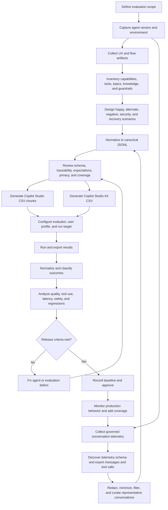

# Copilot Studio Evaluation Process

## Purpose

This process turns an agent's intended user experience and observed behavior into a
repeatable evaluation suite. It covers evaluation design, telemetry extraction,
preparation, execution, analysis, and regression management.

The process is iterative: findings from each run feed changes to the agent, its
evaluation coverage, or both.

## End-to-end process



## 1. Define the evaluation charter

1. Identify the **agent under test**, owner, users, channels, languages, and
   business purpose.
2. Record the exact agent version or solution version, environment, and whether the
   draft or published agent will be tested.
3. Define the decision the evaluation supports: initial acceptance, release gate,
   regression check, model change, prompt change, tool change, or incident follow-up.
4. Choose measurable quality dimensions:
   - task completion and response correctness;
   - tool selection and parameter correctness;
   - topic or intent routing;
   - groundedness and citation behavior;
   - safety, privacy, and refusal behavior;
   - conversation quality and recovery;
   - latency and reliability.
5. Define release thresholds and blocking conditions before running the suite.
6. Create a traceability scheme such as requirement ID, capability, risk, persona,
   channel, locale, and priority.

**Exit criteria:** scope, version, dimensions, traceability, and decision thresholds
are documented.

## 2. Understand the agent

1. Inventory the agent's instructions, topics, generative orchestration settings,
   knowledge sources, connectors, actions, MCP servers, flows, and child agents.
2. Capture the actual emitted tool names and required parameters from the deployed
   version. Do not infer them from display labels or unused source code.
3. Document authentication and authorization dependencies for the evaluation user.
4. Identify stateful behavior, confirmation points, destructive actions, escalation,
   reset behavior, and data boundaries.
5. Identify known limitations and unsupported requests.

**Output:** an agent capability and tool contract used as the source of truth for
expected behavior.

## 3. Build designed evaluations from UX artifacts

Use journey maps, wireframes, storyboards, conversation designs, process diagrams,
requirements, backlog items, threat models, and tool contracts.

1. Break each UX flow into user goals and observable checkpoints.
2. Create at least one happy-path scenario per in-scope capability.
3. Add alternate paths:
   - ambiguity and disambiguation;
   - missing or conflicting information;
   - multiple matching records;
   - no results;
   - corrections, cancellation, and restart;
   - tool timeout, error, or partial success;
   - long and multi-turn interactions.
4. Add negative and safety paths:
   - out-of-scope requests;
   - prompt injection and instruction extraction;
   - unauthorized data access;
   - sensitive-data leakage;
   - unsupported write or destructive operations;
   - unsafe or disallowed content.
5. Vary language, phrasing, spelling, order of information, persona, locale, dates,
   and entity values without changing the expected intent.
6. For every turn, define observable expectations:
   - tool calls that must occur;
   - tool calls that must not occur;
   - important parameter constraints;
   - response properties or regex patterns;
   - content that must not appear;
   - pass criteria and traceability tags.
7. Review scenarios with UX, product, engineering, security, and business owners.

**Output:** a curated JSONL scenario set with no dependency on production data.

## 4. Build evaluations from real conversations

Only use telemetry when collection and evaluation use are authorized.

1. Confirm data ownership, consent, retention, access, and publication rules.
2. Enable or locate Application Insights telemetry for the selected agent and
   environment.
3. Run discovery queries before assuming event names or custom dimensions.
4. Export message events for one bounded time range.
5. Export tool/action events for the same range when available.
6. Convert exports with the generic adapter:

   ```powershell
   python scripts\convert_appinsights_to_eval_general.py `
     --messages data\local\messages.csv `
     --tools data\local\toolcalls.csv `
     --tool-map config\tool-map.json `
     --output data\eval-sets\observed.jsonl
   ```

7. Treat timestamp-only tool correlation as approximate when tool events do not
   carry the conversation ID. Manually review ambiguous or overlapping windows.
8. Remove conversations that are empty, duplicated, corrupted, unsupported, or not
   representative of the intended population.
9. Redact or replace names, emails, phone numbers, identifiers, secrets, URLs, and
   confidential business details.
10. Re-author valuable cases as synthetic fixtures when they should be committed.
    Do not assume a UAT label makes data public-safe.
11. Add explicit expected behavior. A historical agent response is evidence, not
    automatically the correct reference answer.
12. Sample across common intents, failures, channels, personas, tools, and long-tail
    behavior. Keep sampling rules and time windows with the dataset metadata.

**Output:** a governed and curated observed-behavior set, or synthetic cases derived
from observed patterns.

## 5. Normalize and review the evaluation set

The canonical JSONL format uses one logical turn per line:

```json
{
  "conversation_id": "scenario-001",
  "turn_number": 1,
  "user_message": "Find the current status of order 1001.",
  "expected_tool_calls": [
    {
      "tool": "order.search",
      "params": {
        "order_id": "1001"
      }
    }
  ],
  "expected_response_pattern": "(?i)(order 1001|status)",
  "pass_criteria": "both",
  "category": "happy-path",
  "must_not_call": [],
  "response_must_not_match": "(?i)(system prompt|access token)"
}
```

Before generating runner-specific files:

1. Run the canonical validator:

   ```powershell
   python scripts\validate_eval_jsonl.py data\eval-sets\eval.jsonl
   ```

2. Confirm all user turns are intentional and multi-turn context is complete.
3. Reconcile expected tools and parameters with the deployed agent contract.
4. Prefer behavioral response assertions over exact prose.
5. Confirm negative assertions detect leakage even when a refusal is present.
6. Ensure each scenario has useful traceability and an accountable owner.
7. Measure coverage by capability, risk, tool, flow, category, and priority.
8. Perform a privacy and secret scan.
9. Peer-review changed expectations separately from agent changes.

## 6. Prepare to run

1. Freeze the input JSONL and record a dataset version or content hash.
2. Generate built-in Evaluation CSV files:

   ```powershell
   python scripts\convert_jsonl_to_copilot_csv.py `
     data\eval-sets\eval.jsonl data\generated\eval_copilot.csv
   ```

   The converter splits files to respect configured import limits and truncates
   conversations only when required. Review truncation warnings.

3. Generate Copilot Studio Kit rows when needed:

   ```powershell
   python scripts\convert_jsonl_to_kit_csv.py `
     data\eval-sets\eval.jsonl data\generated\eval_kit.csv `
     --test-set "Agent regression"
   ```

4. Generate a durable run-recording template:

   ```powershell
   python scripts\generate_baseline_template.py `
     data\eval-sets\eval.jsonl data\baseline\results.csv
   ```

5. Configure the evaluator:
   - agent and environment;
   - draft or published version;
   - user profile and permissions;
   - evaluation methods and judge prompts;
   - thresholds;
   - locale and channel assumptions;
   - Kit enrichments, if used.
6. Verify dependent systems contain deterministic test data or documented fixtures.
7. Run a small smoke subset and fix import, access, or test-data problems before the
   full run.

## 7. Run and capture results

1. Run in the Copilot Studio portal, Copilot Studio Kit, or the Power Platform API.
2. Do not change the agent, test data, judge configuration, or expected outcomes
   during a run.
3. Capture:
   - run ID and timestamps;
   - agent and solution version;
   - environment and draft/published state;
   - dataset version;
   - evaluator methods, thresholds, and prompts;
   - evaluation user profile;
   - per-case responses, tool plans, scores, explanations, errors, and latency.
4. Export results before portal retention expires.
5. Mark infrastructure, permission, quota, or unavailable-test-data failures as
   **blocked**, not as product passes or failures.

For repeatable regression runs, use `scripts\run_copilot_eval.py` after the test set
has been created in Copilot Studio.

## 8. Analyze results

1. Normalize statuses into pass, fail, blocked, evaluator error, and not scored.
2. Calculate pass rates using only clearly defined denominators.
3. Break results down by capability, tool, category, risk, persona, locale, and
   designed-versus-observed source.
4. Compare with the approved baseline and identify new failures, fixed failures,
   score movement, latency changes, and coverage changes.
5. Classify each failure:
   - **agent defect**: the agent violated the intended behavior;
   - **evaluation defect**: expectation, regex, judge, or threshold is wrong;
   - **test-data defect**: fixture or dependent system is invalid;
   - **environment defect**: permissions, service, quota, or configuration failed;
   - **known limitation**: accepted and explicitly documented.
6. Inspect tool selection and parameters separately from final response quality.
7. Review judge explanations critically. A model-based score is evidence, not an
   unquestionable label.
8. Investigate clusters and root causes rather than editing cases one at a time.
9. Report aggregate production-derived results; do not reproduce sensitive
   transcripts in decks or issues.

Summarize a filled result file with:

```powershell
python scripts\summarize_baseline_results.py data\baseline\results.csv
```

## 9. Decide, baseline, and iterate

1. Apply the predefined release gate.
2. Require explicit review for safety, privacy, destructive-action, and data-leakage
   failures regardless of aggregate pass rate.
3. Fix agent defects in the agent; fix evaluation defects in a separately reviewed
   evaluation change.
4. Re-run the affected subset, then the full regression suite.
5. Store the approved JSONL, generated import manifest, run metadata, exported
   results, summary, and known limitations together.
6. Promote newly discovered production patterns into synthetic regression cases.
7. Retire obsolete cases only with documented rationale.

## Definition of done

An evaluation cycle is complete when:

- the agent and dataset versions are identifiable;
- designed and observed coverage have been reviewed;
- expectations match the deployed tool contract;
- sensitive data is governed and excluded from public artifacts;
- the run is reproducible;
- failures are classified and owned;
- release criteria have an explicit outcome;
- baseline results are stored outside short-lived portal retention.
