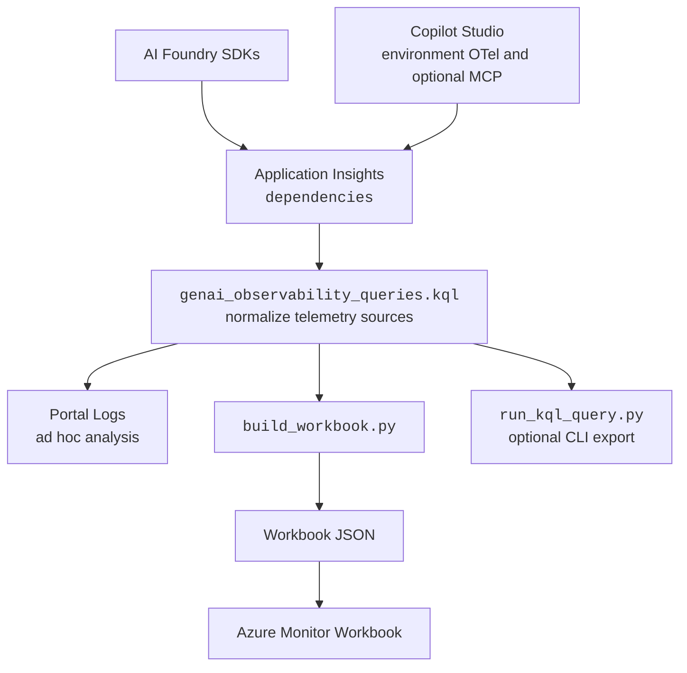

# GenAI Observability — Overview

What was built on the `feature/kql` branch: a portable **KQL + dashboard**
package that reports **cost, token usage, and tool performance** for GenAI
workloads whose telemetry lands in **Azure Application Insights**, across two
platforms — **Azure AI Foundry** and **Microsoft Copilot Studio**.

This document explains *what it is* and *how it works*. For step-by-step Azure
setup see [`deployment-guide.md`](deployment-guide.md); for the limits of what
App Insights can tell us see [`app-insights-gap-analysis.md`](app-insights-gap-analysis.md).

---

## 1. What was built

| Artifact | Path | Role |
| --- | --- | --- |
| **Query set** | `queries/genai_observability_queries.kql` | Q0 discovery + Q1–Q5 analytics. Portal-runnable; `ago()`-based windows. Uses the repo's `// QUERY <id>:` header convention. |
| **Workbook builder** | `dashboards/build_workbook.py` | stdlib-only Python that parses the `.kql` and emits the workbook — the `.kql` stays the single source of truth. |
| **Workbook** | `dashboards/genai_observability_workbook.json` | Generated Azure Monitor Workbook; one tile per query, bound to a shared time-range parameter. |
| **Gap analysis** | `docs/app-insights-gap-analysis.md` | What each platform does/doesn't emit; where Dataverse helps. |
| **README** | `README.md` | Quick usage. |

### The five analytics (plus a discovery query)

| # | Query | AI Foundry | Copilot Studio |
| --- | --- | :---: | :---: |
| 0 | Source / telemetry inventory | ✅ | ✅ |
| 1 | Tool invocation frequency & error rate per tool | ✅ | ✅ |
| 2 | Token usage by model (daily; weekly = change one bin) | ✅ | ❌ |
| 3 | Tool latency p50 / p95 / p99 per tool | ✅ | ✅ |
| 4 | Estimated cost per conversation (tokens × pricing) | ✅ | ❌ |
| 5 | Top-10 most expensive conversations | ✅ | ❌ |

> ⚠️ **Warning:** Copilot Studio emits **no token counts** to App Insights, so
> the cost/token queries (2, 4, 5) are AI-Foundry-only. This is the central
> finding of the gap analysis and is confirmed empirically (see §5).

---

## 2. Data sources

All three telemetry flavours land in the App Insights **`dependencies`** table.
Verified 2026-07-29 against Microsoft Learn and the Azure SDK source.

### A. Azure AI Foundry (OpenTelemetry GenAI)
Emitted by `azure-ai-inference` / `azure-ai-agents` (or the OpenAI SDK + OTel
instrumentor). Key `customDimensions`:

- `gen_ai.system` = `az.ai.inference` | `az.ai.agents` | `openai`
- `gen_ai.operation.name` = `chat` | `execute_tool` | `process_thread_run` …
- `gen_ai.request.model` / `gen_ai.response.model`
- `gen_ai.usage.input_tokens` / `gen_ai.usage.output_tokens` (**no** total — derived)
- `gen_ai.tool.name` / `gen_ai.tool.call.id`
- `gen_ai.conversation.id` / `gen_ai.thread.id` / `gen_ai.agent.id`
- Span name = `chat {model}` | `execute_tool {tool}`

### B. Copilot Studio — environment-level OTel (preview)
`dependencies`, `type == "GenAI"`, `name in ("InvokeAgent","ExecuteTool","OutputMessages")`:

- `resource.provider` = `copilot studio`
- `gen_ai.conversation.id`, `gen_ai.request.model` (name only), `gen_ai.tool.name`
- **No** `gen_ai.usage.*` token fields.

### C. Copilot Studio — optional legacy MCP
`dependencies`, `name == "mcp.tool"`:

- provider-specific custom dimensions for tool name and outcome
- **No** token fields.

Common `dependencies` columns used throughout: `duration` (ms, float),
`success` (bool), `resultCode` (`OK`/`ERROR`), `operation_Id`.

---

## 3. How it works

**Normalization.** Each query reads `dependencies`, derives a `source`
(AI Foundry / Copilot Studio env OTel / Copilot Studio MCP) from `gen_ai.system`
+ `resource.provider` + `name`, and a unified `toolName` from
`gen_ai.tool.name` ?? `mcp.tool.name`. Errors fold `success == false`,
`resultCode == "ERROR"`, and any configured MCP outcome dimension. Cost joins a small in-query
`pricing` datatable after collapsing versioned deployment names (e.g.
`gpt-4o-2024-08-06` → `gpt-4o`) to a price key; conversation id coalesces
`gen_ai.conversation.id` → `gen_ai.thread.id` → `operation_Id`.

**Dashboard build.** `build_workbook.py` parses the `.kql` by its
`// QUERY <id>:` headers, strips comment lines, swaps each `where timestamp >
ago(...)` for the workbook `{TimeRange}` parameter, and writes tiles (table /
barchart / timechart) into a gallery-template Workbook. Re-run it after any query
edit so the dashboard stays in sync.

---

## 4. What it deliberately does not do

See the [gap analysis](app-insights-gap-analysis.md). In short: **no Copilot
Studio token/cost** (not in App Insights or Dataverse); reasoning tokens aren't
itemised; pricing is a maintained snapshot, not telemetry; and conversation ids
aren't uniform across sources.

---

## 5. Validation

Validate every query against the target environment before publishing metrics.
Telemetry paths and custom dimensions can differ by platform version, channel,
integration, and local instrumentation.

> 📝 **Note:** Run **Query 0 first** in any new environment to confirm which
> sources and `gen_ai.system` values are present before trusting Q1–Q5.
